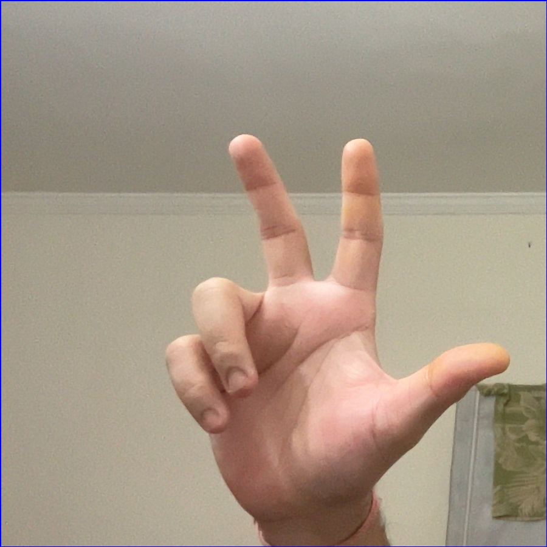

# Gesture Vision

<h1> Dependencies</h1>
There will be requirement of installing dependencies based on the modules used in this project like tensorflow, keras, fast autocomplete[leverkusen], gTTs and etc.   
<h1> How to run the project</h1>
To recreate the 2D CNN model that has been used for this tool: 
1. Clone this repository 
2. Unzip the asl_dataset.zip file. 
3. Get into the directory of ./asl_classification/2d_cnn.  
4. Run the create_dataset.py file. Ensure that the direrctory is correct. If this is executed successfully, a pickle file of the data will be created.  
5. Next step is Training the 2D CNN. Run the train_2D_cnn.py file. This will train and save the model to the cnn_model_2d.h5.  
6. Now train the RNN model for next word prediction by running next_word_predictor.py file. This will save next_word_model.h5 file.  
7. Use image_classifier_cnn.py for classification.  
<h1>Ensure that the path to unzipped asl_dataset is correct in create dataset file</h1>
  
<h1>Random Forest Code is also provided for reference but the project is based on CNN.</h1> 

# Information about next sign

 For prediction of the character, signs to be used can be found in asl_dataset folder in main folder. Inside asl_dataset, folders 0 to 25 contains sign for A to Z, folder 26 is for taking next frame, 27 is for space, 28 is for taking current word suggestion, 29 is for taking next word suggestion, 30 is for backspacing in current word and 31 is for converting text to speech. After prediction of each character, user is needed to provide sign that allows for taking next input, sign shown above. It makes th model ready to take next character as input. If this is not provided then user won't be able to provide any sign. 

# Example for getting "ABC" as text

1. Show sign for character "A".
2. Show sign to continue to next input i.e., show next sign shown above.
3. Show sign for character "B".
4. Show sign to continue to next input i.e., show next sign shown above.
5. Show sign for character "C".   
   This will create Current Sentence: "ABC" 

#  Details can be found in Project Report.
